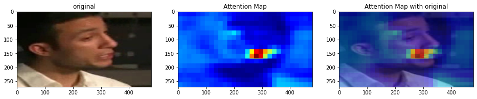
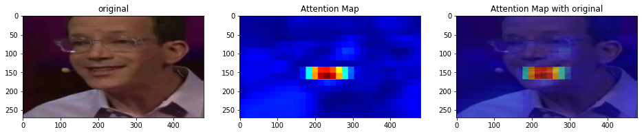
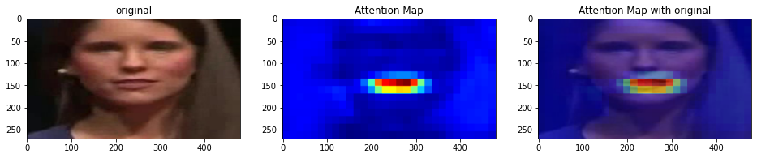

# About this repository

Unofficial pytorch implementation Self-Supervised Learning of Audio-Visual Objects from Video[[project page]](https://www.robots.ox.ac.uk/~vgg/research/avobjects/)

## Installation
### Requirements

- Linux
- Python 3.6+
- PyTorch 1.8.1 or higher and CUDA

a. Create a conda virtual environment and activate it.

```shell
conda create -n avobject_torch python=3.6
conda activate avobject_torch
```

b. Install PyTorch and torchvision following the [official instructions](https://pytorch.org/)

c. Clone this repository.

```shell
git clone https://github.com/yw0nam/avobject_torch/
cd avobject_torch
```
d. Install requirments.

```shell
pip install -r requirements.txt
```


# Dataset

Trained by [LRS3](https://www.robots.ox.ac.uk/~vgg/data/lip_reading/lrs3.html) or [LRS2](https://www.robots.ox.ac.uk/~vgg/data/lip_reading/lrs2.html)

data | training sample | validation sample |
--- | --- | --- |
LRS2 | 72052 | 158 |
LRS3 | 88520 | 408 | 

# Training 

a. run makefile_ls.py to generate dev.txt, test.txt
```shell
python makefile_ls.py --root_dir dataset_root
```

b. Run training code(you can change the parameter, check the argparser in train.py)
```shell
python train.py 
```

# Prediction 

Not implement yet, It will be released soon.

# Result

Note that, This repository is ongoing project.

I'm still training this model, and implement downstream work(like Active speaker detection, Sound source seperation)


data | train loss | validation loss | epoch |
--- | --- | --- | --- |
LRS2 | 0.234909 |  0.065351 | 6 |
LRS3 | 0.311373 |  0.208642 | 3 |

Here is model prediction result trained by LRS2. 

 
 
 


# Thanks to

The repository is based on [syncnet_trainer](https://github.com/joonson/syncnet_trainer) and [avobject](https://github.com/afourast/avobjects).
